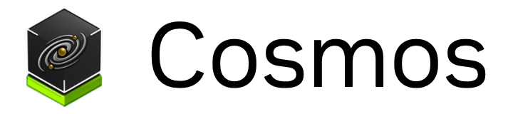

--------------------------------------------------------------------------------
### [Website](https://www.nvidia.com/en-us/ai/cosmos/) | [HuggingFace](https://huggingface.co/collections/nvidia/cosmos-6751e884dc10e013a0a0d8e6) | [GPU-free Preview](https://build.nvidia.com/explore/discover) | [Paper](https://arxiv.org/abs/2501.03575) | [Paper Website](https://research.nvidia.com/labs/dir/cosmos1/)

[NVIDIA Cosmos](https://www.nvidia.com/cosmos/) is a developer-first world foundation model platform designed to help Physical AI developers build their Physical AI systems better and faster. Cosmos contains

1. pre-trained models, available via [Hugging Face](https://huggingface.co/collections/nvidia/cosmos-6751e884dc10e013a0a0d8e6) under the [NVIDIA Open Model License](https://www.nvidia.com/en-us/agreements/enterprise-software/nvidia-open-model-license/) that allows commercial use of the models for free
2. training scripts under the [Apache 2 License](https://www.apache.org/licenses/LICENSE-2.0), offered through [NVIDIA Nemo Framework](https://github.com/NVIDIA/NeMo) for post-training the models for various downstream Physical AI applications

Details of the platform is described in the [Cosmos paper](https://research.nvidia.com/publication/2025-01_cosmos-world-foundation-model-platform-physical-ai). Preview access is avaiable at [build.nvidia.com](https://build.nvidia.com).

## Key Features

- [Pre-trained Diffusion-based world foundation models](cosmos1/models/diffusion/README.md) for Text2World and Video2World generation where a user can generate visual simulation based on text prompts and video prompts.
- [Pre-trained Autoregressive-based world foundation models](cosmos1/models/autoregressive/README.md) for Video2World generation where a user can generate visual simulation based on video prompts and optional text prompts.
- [Video tokenizers](https://github.com/NVIDIA/Cosmos-Tokenizer) for tokenizing videos into continuous tokens (latent vectors) and discrete tokens (integers) efficiently and effectively.
- Video curation pipeline for building your own video dataset. [Coming soon]
- [Post-training scripts](cosmos1/models/POST_TRAINING.md) via NeMo Framework to post-train the pre-trained world foundation models for various Physical AI setup.
- Pre-training scripts via NeMo Framework for building your own world foundation model. [[Diffusion](https://github.com/NVIDIA/NeMo/tree/main/nemo/collections/diffusion)] [[Autoregressive](https://github.com/NVIDIA/NeMo/tree/main/nemo/collections/multimodal_autoregressive)] [[Tokenizer](https://github.com/NVIDIA/NeMo/tree/main/nemo/collections/diffusion/vae)].

## Model Family

| Model name | Description | Try it out |
|------------|----------|----------|
| [Cosmos-1.0-Diffusion-7B-Text2World](https://huggingface.co/nvidia/Cosmos-1.0-Diffusion-7B-Text2World) | Text to visual world generation  | [Inference](cosmos1/models/diffusion/README.md)   |
| [Cosmos-1.0-Diffusion-14B-Text2World](https://huggingface.co/nvidia/Cosmos-1.0-Diffusion-14B-Text2World) | Text to visual world generation  | [Inference](cosmos1/models/diffusion/README.md)   |
| [Cosmos-1.0-Diffusion-7B-Video2World](https://huggingface.co/nvidia/Cosmos-1.0-Diffusion-7B-Video2World) | Video + Text based future visual world generation  | [Inference](cosmos1/models/diffusion/README.md)   |
| [Cosmos-1.0-Diffusion-14B-Video2World](https://huggingface.co/nvidia/Cosmos-1.0-Diffusion-14B-Video2World) | Video + Text based future visual world generation  | [Inference](cosmos1/models/diffusion/README.md)   |
| [Cosmos-1.0-Autoregressive-4B](https://huggingface.co/nvidia/Cosmos-1.0-Autoregressive-4B) | Future visual world generation  | [Inference](cosmos1/models/autoregressive/README.md)   |
| [Cosmos-1.0-Autoregressive-12B](https://huggingface.co/nvidia/Cosmos-1.0-Autoregressive-12B) | Future visual world generation  | [Inference](cosmos1/models/autoregressive/README.md)   |
| [Cosmos-1.0-Autoregressive-5B-Video2World](https://huggingface.co/nvidia/Cosmos-1.0-Autoregressive-5B-Video2World) | Video + Text based future visual world generation | [Inference](cosmos1/models/autoregressive/README.md)   |
| [Cosmos-1.0-Autoregressive-13B-Video2World](https://huggingface.co/nvidia/Cosmos-1.0-Autoregressive-13B-Video2World) | Video + Text based future visual world generation | [Inference](cosmos1/models/autoregressive/README.md)   |
| [Cosmos-1.0-Guardrail](https://huggingface.co/nvidia/Cosmos-1.0-Guardrail) | Guardrail contains pre-Guard and post-Guard for safe use | Embedded in model inference scripts |

## Example Usage

### Inference

Follow the [Cosmos Installation Guide](INSTALL.md) to setup the docker. For inference with the pretrained models, please refer to [Cosmos Diffusion Inference](cosmos1/models/diffusion/README.md) and [Cosmos Autoregressive Inference](cosmos1/models/autoregressive/README.md).

The code snippet below provides a gist of the inference usage.

```bash
PROMPT="A sleek, humanoid robot stands in a vast warehouse filled with neatly stacked cardboard boxes on industrial shelves. \
The robot's metallic body gleams under the bright, even lighting, highlighting its futuristic design and intricate joints. \
A glowing blue light emanates from its chest, adding a touch of advanced technology. The background is dominated by rows of boxes, \
suggesting a highly organized storage system. The floor is lined with wooden pallets, enhancing the industrial setting. \
The camera remains static, capturing the robot's poised stance amidst the orderly environment, with a shallow depth of \
field that keeps the focus on the robot while subtly blurring the background for a cinematic effect."

# Example using 7B model
PYTHONPATH=$(pwd) python cosmos1/models/diffusion/inference/text2world.py \
    --checkpoint_dir checkpoints \
    --diffusion_transformer_dir Cosmos-1.0-Diffusion-7B-Text2World \
    --prompt "$PROMPT" \
    --offload_prompt_upsampler \
    --video_save_name Cosmos-1.0-Diffusion-7B-Text2World
```

<video src="https://github.com/user-attachments/assets/db7bebfe-5314-40a6-b045-4f6ce0a87f2a">
  Your browser does not support the video tag.
</video>

We also offer [multi-GPU inference](cosmos1/models/diffusion/nemo/inference/README.md) support for Diffusion Text2World WFM models through NeMo Framework.

### Post-training

NeMo Framework provides GPU accelerated post-training with general post-training for both [diffusion](cosmos1/models/diffusion/nemo/post_training/README.md) and [autoregressive](cosmos1/models/autoregressive/nemo/post_training/README.md) models, with other types of post-training coming soon.

## License and Contact

This project will download and install additional third-party open source software projects. Review the license terms of these open source projects before use.

NVIDIA Cosmos source code is released under the [Apache 2 License](https://www.apache.org/licenses/LICENSE-2.0).

NVIDIA Cosmos models are released under the [NVIDIA Open Model License](https://www.nvidia.com/en-us/agreements/enterprise-software/nvidia-open-model-license). For a custom license, please contact [cosmos-license@nvidia.com](mailto:cosmos-license@nvidia.com).
